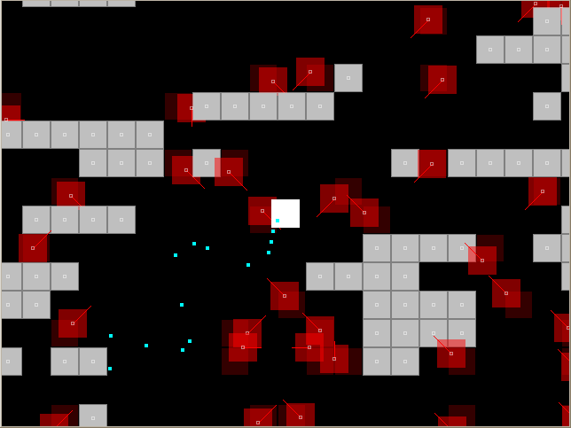

# julia-hordewave

a minimal port from my javascript version

* 20210705: installed julia for the first time
* 20210708: v01 slanged

# info

* Move with WASD/ARROWS

* Shoot with mouse

* How I run it, as an ultimate julia newb:

>    julia> cd("GameOne")
>
>    (@v1.6) pkg> activate .
>
>    julia> using GameOne
>
>    julia> rungame("C:\\code21-julia-gamezero\\hordewave\\Main.jl")

